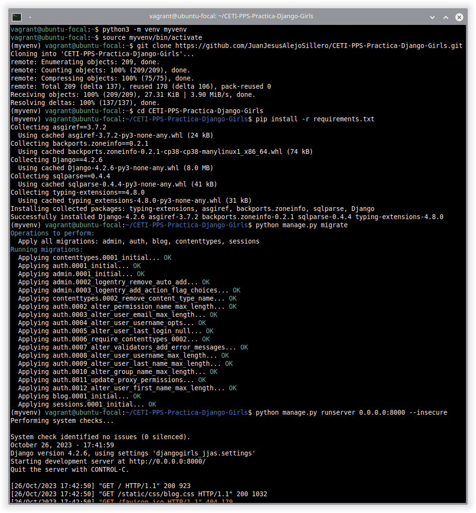
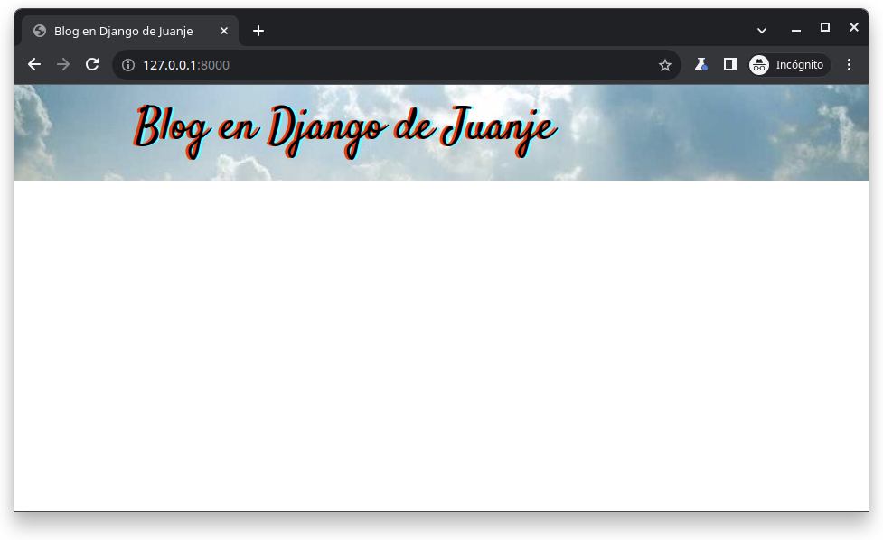
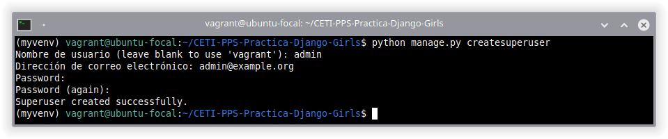
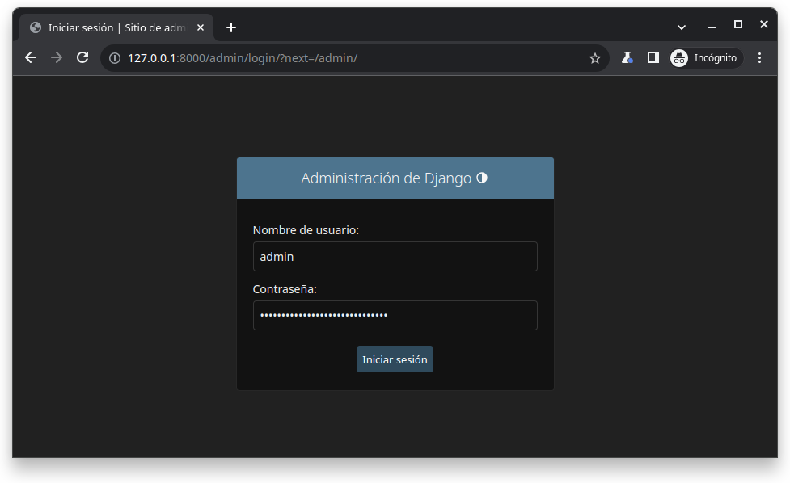
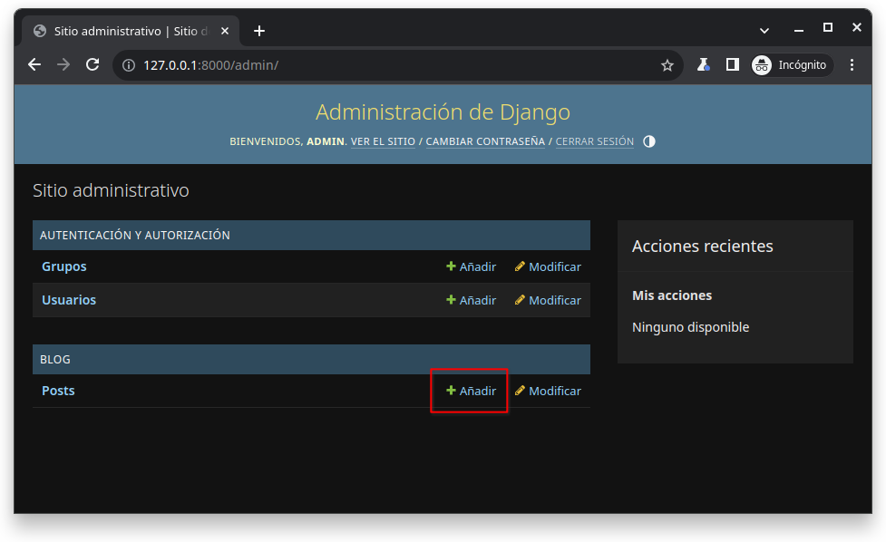
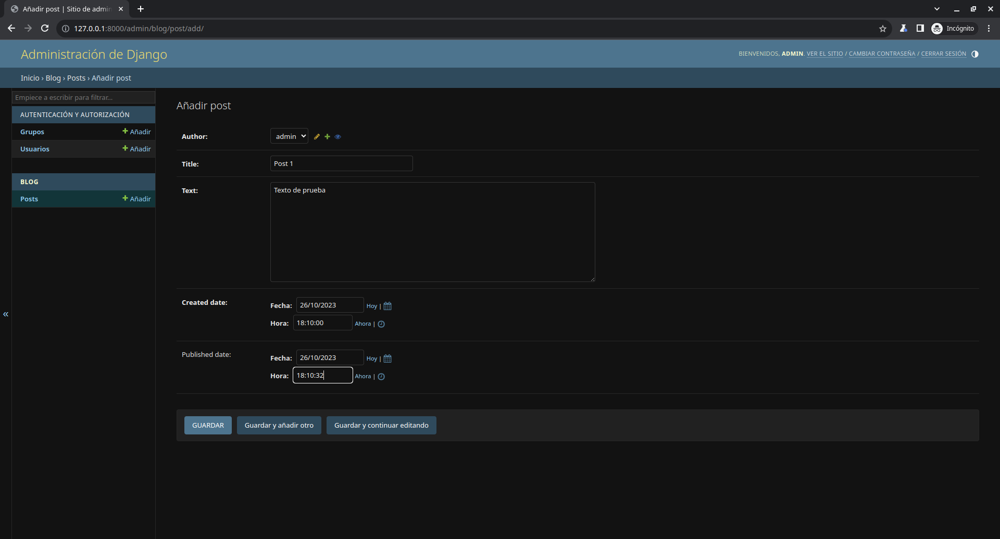
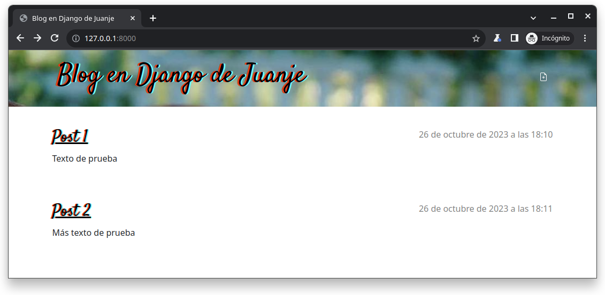
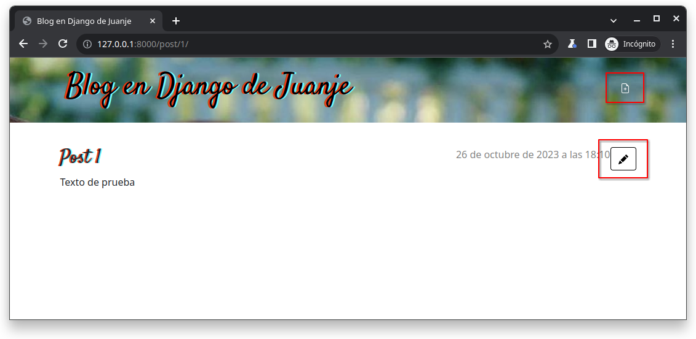
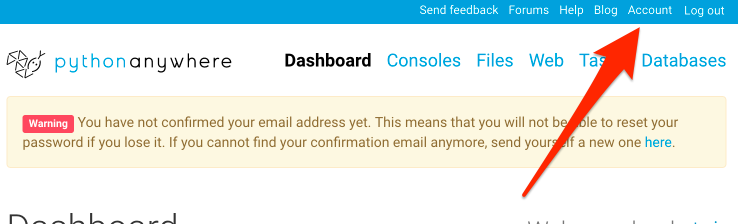
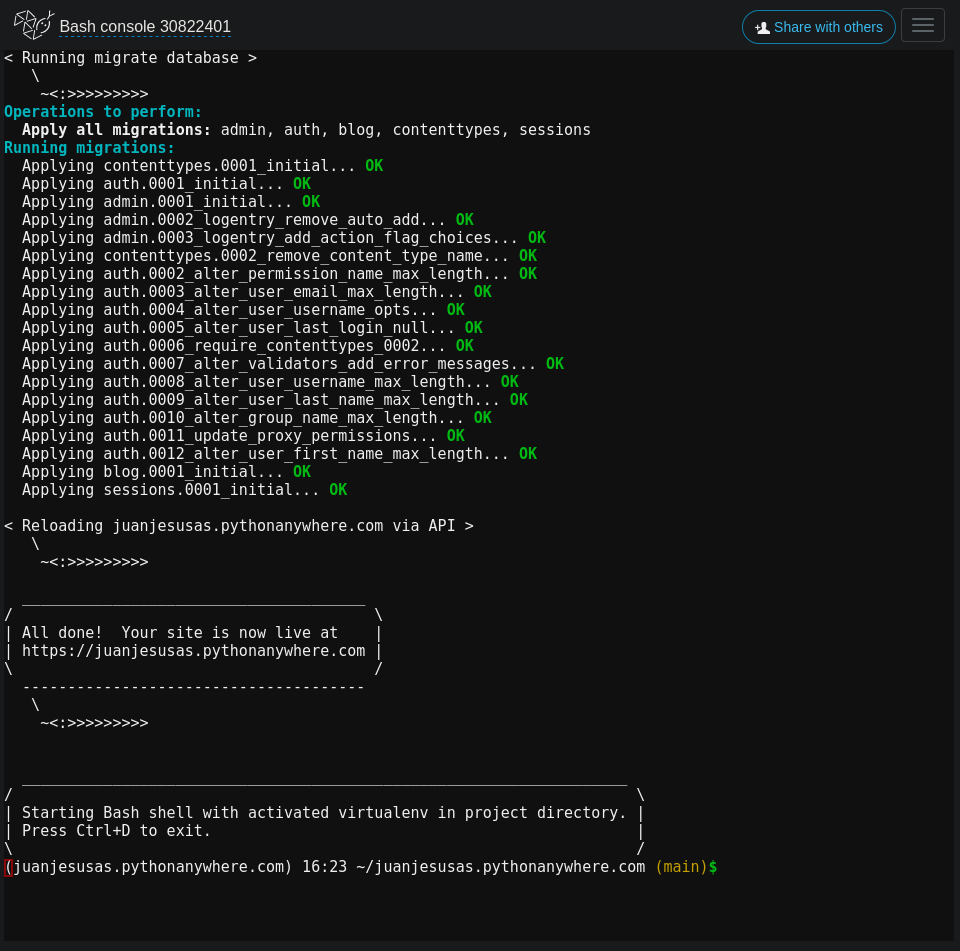

<p align="center">
  <a href="" rel="noopener">
 </a>
</p>

<h3 align="center">Práctica Django Girls</h3>

<div align="center">

[](https://github.com/JuanJesusAlejoSillero/CETI-PPS-Practica-Django-Girls/issues)
[](https://github.com/JuanJesusAlejoSillero/CETI-PPS-Practica-Django-Girls/pulls)
<br>


</div>

---

## **📝 Tabla de contenidos**

- [**🏁 Cómo empezar**](#-cómo-empezar)
  - [**Requisitos previos**](#requisitos-previos)
  - [**Entorno virtual**](#entorno-virtual)
- [**🔧 Añadir posts**](#-añadir-posts)
- [**🚀 Despliegue**](#-despliegue)
- [**⛏️ Hecho con**](#️-hecho-con)

## **🏁 Cómo empezar**

### **Requisitos previos**

Para poder ejecutar este proyecto, necesitarás tener instalado las siguientes herramientas:

- Git
- Python
- pip
- virtualenv

El [tutorial del proyecto](https://tutorial.djangogirls.org/en/) está documentado sobre Ubuntu por lo que será el sistema operativo en el que se enfocará este repositorio.

Las instrucciones serán similares para otras distribuciones de Linux, variando únicamente en los pasos en los que se haga uso del gestor de paquetes (`apt`).

1. Comenzamos actualizando la base de datos de los paquetes:

    ```bash
    sudo apt update
    ```

2. Instalamos `git`:

    ```bash
    sudo apt install git
    ```

3. Instalamos python3, pip y virtualenv:

    ```bash
    sudo apt install python3 python3-pip python3-venv
    ```

### **Entorno virtual**

Para poder instalar las dependencias del proyecto sin afectar a las del sistema, se recomienda el uso de entornos virtuales:

1. Creamos un entorno virtual:

    ```bash
    python3 -m venv myvenv
    ```

2. Activamos el entorno virtual:

    ```bash
    source myvenv/bin/activate
    ```

3. Clonamos el repositorio y nos ubicamos en él:

    ```bash
    git clone https://github.com/JuanJesusAlejoSillero/CETI-PPS-Practica-Django-Girls.git

    cd CETI-PPS-Practica-Django-Girls
    ```

4. Instalamos las dependencias del proyecto en el entorno virtual:

    ```bash
    pip install -r requirements.txt
    ```

5. Realizamos las migraciones de la base de datos:

    ```bash
    python manage.py migrate
    ```

6. Ejecutamos el servidor en local:

    ```bash
    python manage.py runserver 0.0.0.0:8000 --insecure
    ```

    

7. Accedemos a <http://127.0.0.1:8000> en nuestro navegador para ver la página:

    

## **🔧 Añadir posts**

Tras el apartado anterior tendremos la web funcionando pero vacía. Para añadir contenido, primero debemos crear un usuario administrador. Pulsamos `Ctrl + C` para detener el servidor y ejecutamos el siguiente comando (la contraseña no será visible mientras la escribimos):

```bash
python manage.py createsuperuser
```



Ejecutamos el servidor de nuevo:

```bash
python manage.py runserver 0.0.0.0:8000 --insecure
```

Y accedemos a <http://127.0.0.1:8000/admin> para iniciar sesión con el usuario que acabamos de crear:



Una vez dentro, podemos crear nuevos posts:



Debemos asegurarnos de que tenga fecha de creación y publicación anterior a la actual, de lo contrario no aparecerá en la página principal:



Tras crear un par de ellos, podemos verlos en la página principal:



Si nos fijamos en la esquina superior derecha veremos que podremos editarlo, y también crear otro nuevo:



## **🚀 Despliegue**

Para desplegar este proyecto, usaremos [PythonAnywhere](https://www.pythonanywhere.com/) para alojar la página y se asume que ya contamos con un repositorio de [GitHub](https://github.com) para almacenar el código.

1. Creamos una cuenta en [PythonAnywhere](https://www.pythonanywhere.com), con el plan gratuito es suficiente.

2. Tras crearla, accedemos a nuestro panel de cuenta y creamos un Token para la API:

    

    

3. Una vez que tengamos el token, vamos al dashboard de la página principal y seleccionamos la opción de crear una nueva consola de Bash:

    

4. En ella, ejecutamos el helper de PythonAnywhere:

    ```bash
    pip3 install --user pythonanywhere
    ```

5. Una vez veamos el mensaje de que se ha instalado correctamente, ejecutamos el siguiente comando para clonar nuestro repositorio:

    ```bash
    pa_autoconfigure_django.py https://github.com/<usuario>/<repositorio>.git
    ```

    

6. Al finalizar, nos indicará que nuestra web está disponible en <https://\<usuario\>.pythonanywhere.com>.

7. Para poder acceder a la página de administración, debemos crear un superusuario igual que hicimos en local en el [apartado anterior](#-añadir-posts):

    ```bash
    python manage.py createsuperuser
    ```

8. Al igual que el usuario administrador no se ha creado automáticamente, tampoco lo harán los posts. Para ello, seguimos los mismos pasos que antes.

9. Una vez creados, podremos verlos en la página principal de <https://\<usuario\>.pythonanywhere.com>, el panel de administración se encontrará en <https://\<usuario\>.pythonanywhere.com/admin>.

## **⛏️ Hecho con**

- **📖 Tutorial:** [**Django Girls**](https://tutorial.djangogirls.org/en/)
- **🌐 Hosting:** [**PythonAnywhere**](https://www.pythonanywhere.com/)
- **📦 Repositorio para el código fuente:** [**GitHub**](https://github.com)
